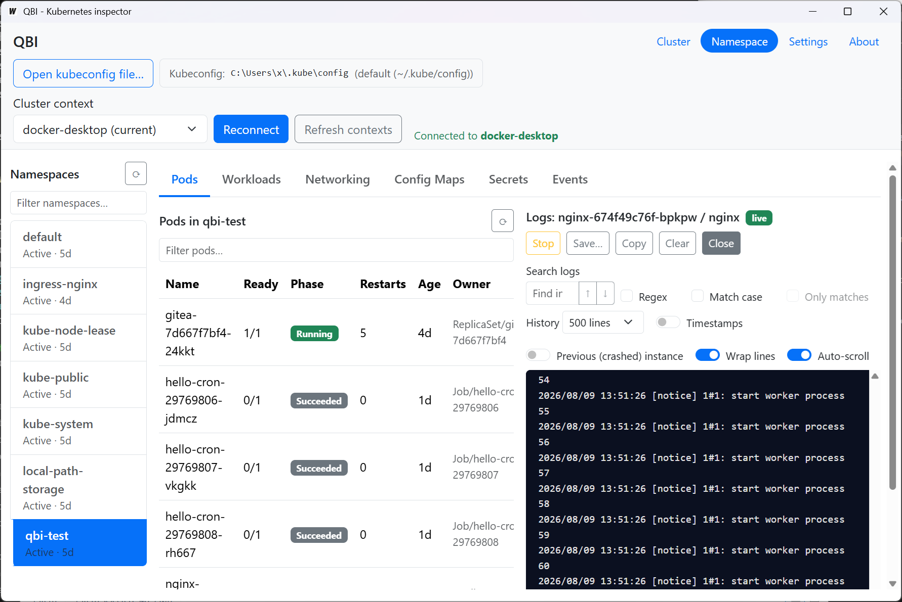
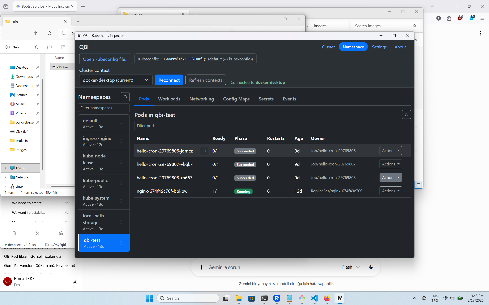

# QBI - another Kubernetes inspector

QBI is a lightweight desktop app for inspecting and debugging Kubernetes
clusters. Point it at a kubeconfig, pick a context and you get a clean,
readable view of your namespace: pods, workloads, networking, config maps,
secrets, events and node metrics, plus a log viewer that stays usable under
pressure.

The name is a small pun: q stands for kubernetes (a q in place of the k), b
is the b in kubernetes and I is for Inspector.

It was built keyboard-first for screen-reader users, which turned out to make
it a fast, low-noise tool for everyone. Why it exists: [read the story](docs/motivation.md).

> **Status** - early but working (v0.1.0), actively developed. It is not a
> dashboard; there are no charts and no auto-generated walls of YAML.
> Everything is a list or a table you can actually read.

## Features

**Connect in seconds** - Open any kubeconfig file with the native file picker
(or fall back to `KUBECONFIG` / `~/.kube/config`), pick a context, connect.
Your kubeconfig path and last namespace are remembered between launches.

**Pods** - Filterable table with readiness, phase, restarts, age, owner and
node. Per pod:

- **Details** - IPs, node, QoS class, container states with restart reasons,
  conditions, labels and live CPU/memory usage (when metrics-server is present).
- **Logs** - the streaming viewer described below.
- **Shell** - an interactive `kubectl exec` in your OS terminal.
- **YAML** - the resource as Kubernetes sees it.
- **Delete** - with a confirmation that says whether a controller will
  recreate the pod or not.

**Workloads** - Deployments, StatefulSets and DaemonSets with ready counts and
images; degraded workloads are highlighted. Scale, restart (rolling restart)
or delete any of them or create a Deployment from a form with a live YAML
preview. Jobs and CronJobs get their own tables: create and edit CronJobs
(schedule, concurrency policy), suspend/resume them and stream the logs of
the latest run. A *recent rollouts* panel rebuilds deployment history from
ReplicaSet revisions, durable where events are not.

**Networking** - Services with their DNS name, type, ClusterIP, ports, selector
and the endpoints actually backing them, with a clear warning when there are
no ready endpoints. Create and delete services. Ingresses show addresses, TLS
with certificate-secret status and host → path → backend routing rules where
every backend is health-checked (`ok`, `service missing`, `no ready
endpoints`). An **Inspect** panel spells the issues out in plain language,
plus annotations, default backend and the ingress's own events. Create and
edit ingresses with validation that mirrors the API. If the form can't
express something (like a resource backend), it tells you instead of
silently dropping it.

**Config maps** - Full contents per key, with copy-to-clipboard.

**Secrets** - Values stay masked until you reveal them. Edit via a form (a
review dialog lists exactly what will change) or directly in YAML; create new
secrets from a form or a starter template; switch between plain-text and
raw-base64 modes. Binary values are flagged and preserved untouched.

**Events** - Namespace events, newest first, with a warnings-only filter.
Honest about its limits: events expire after ~1 hour, which is why the
rollout history exists.

**Cluster view** - Nodes with health, roles, versions and live CPU/memory
usage, plus a cluster-wide resource summary (`kubectl top nodes` equivalent).
If metrics-server is absent, QBI degrades gracefully instead of erroring.

**Log viewer** - Live streaming with:

- search: plain text or regex, case-sensitivity, live match count,
  `Enter`/`Shift+Enter` to jump between matches and an *only matches* mode;
- previous-instance logs (`kubectl logs -p`) for post-crash diagnosis;
- tail 100 / 500 / 1000 / all, timestamps, wrap and auto-scroll toggles;
- save the current view to a `.log` file or copy it;
- desktop-style line navigation: `↑`/`↓`, `PageUp`/`PageDown`, `Ctrl+C` to
  copy the focused line, `Ctrl+A` to copy everything.

**Live refresh** - Optional auto-refresh: QBI watches the cluster and reloads
views as resources are added or deleted, announcing what changed. Toggle it
in Settings.

**Writes are always confirmed** - Anything that changes the cluster goes
through a native confirmation dialog that defaults to **No** and says exactly
what will happen. More in [Security](#security).


## Screenshots






## Requirements

- [Go](https://go.dev/dl/) 1.25+
- [Node.js](https://nodejs.org/) 18+
- [Wails CLI](https://wails.io/) v2: `go install github.com/wailsapp/wails/v2/cmd/wails@latest`
- A valid kubeconfig (`~/.kube/config`, `KUBECONFIG` or any file you pick in the app)
- `kubectl` on `PATH` (only needed for the pod shell feature)

## Build & run

```bash
# development, with hot reload (installs frontend deps and starts Vite):
wails dev

# production build: the binary lands in build/bin/
wails build
```

The app persists a few preferences (kubeconfig path, auto-refresh) in a
`qbi/settings.json` file inside your OS user-config directory.

## Logging

QBI keeps its own logs so failures can be diagnosed after the fact: bad
YAML, kube edge cases, misconfigurations, crashes. They are **never
telemetry**: the logging pipeline redacts anything sensitive before it
reaches a destination, so a shared log cannot leak your cluster environment.

- **Where:** `<UserConfigDir>/qbi/logs/qbi.log` (e.g.
  `%AppData%\qbi\logs\qbi.log` on Windows), rotating at 5 MB with one backup.
  Timestamps are UTC. Under `wails dev`, logs also appear on stdout.
- **Profiles:** development builds (`wails dev`) log everything at `debug`
  level; production builds (`wails build`) log `info` and above. Both write
  to the file above.
- **Config override:** place a `logging.json` next to `settings.json` in
  `<UserConfigDir>/qbi`, or point `QBI_LOG_CONFIG` at a config file;
  `QBI_LOG_LEVEL` overrides just the level. An unreadable or invalid config
  falls back to the built-in profile.

  ```json
  {
    "level": "debug",
    "outputs": [
      { "type": "stdout", "format": "text" },
      { "type": "file", "format": "json", "path": "logs/qbi.log" }
    ]
  }
  ```

- **Redaction is always on:** IP addresses anywhere in a record are replaced
  by a stable short hash, and values under sensitive keys (`cluster`,
  `context`, `server`, `host`, `kubeconfig`, `password`, `token`, `secret`,
  …) are masked. Cluster names, endpoints and credentials never reach a log
  file. client-go's own logging (klog) goes through the same pipeline.
- **Crash and frontend coverage:** panics are logged with a stack trace, and
  uncaught JavaScript errors are forwarded to the same redacted log.
- **Review before sharing:** redaction is best-effort, so QBI may fail to mask
  some critical data — always review a log before sharing it. When opening an
  issue, attaching the log helps the developers diagnose the problem.

## Development

```bash
go build ./...   # compile check
go vet ./...     # vet

cd frontend
npm test         # vitest: the frontend suite
```

The Go tests in `internal/kube` run against a fake clientset (no cluster
needed): `go test ./...`.

## For LLM users

If you use an LLM coding agent (Claude, Gemini, GitHub Copilot, Reasonix, …),
run this once after cloning so every agent reads the same instructions:

```bash
./scripts/setup-symlinks.sh
```

It creates `AGENT.md`, `GEMINI.md`, `CLAUDE.md`, `.github/copilot-instructions.md` and `REASONIX.md`, each
pointing to `.agent/agent.md`, a single source of truth. On Linux/macOS these
are real symlinks; on Windows they fall back to copies when native symlinks
aren't available.

## Architecture

```
main.go            Wails entry point, embeds the built frontend
app.go             App state + Wails runtime context
service.go         The JS-bound API + log-stream and watch lifecycle
settings.go        Persisted preferences (kubeconfig path, auto-refresh)
internal/kube/     Kubernetes client-go wrapper (no Wails imports)
internal/logging/  slog setup: dev/prod profiles, destinations, redaction
frontend/          Vue 3 + Vite + Bootstrap 5
  src/api.js       Wraps the Wails bindings, maps errors to plain language
  src/logging.js   Forwards uncaught JS errors to the backend log
  src/store.js     Small reactive store (connection, namespace, announcements)
  src/components/  One component per screen (list, detail, create forms…)
```

The frontend talks only to `service.go`, which delegates to `internal/kube`,
a Wails-free layer that could be reused or tested independently. Logs stream
over Wails events (`log:<key>`); Kubernetes watch events are pushed as
`watch:<kind>` and coalesced on the frontend so a burst doesn't reload the
view repeatedly. Every API call is bounded by a 30-second timeout, so a hung
cluster never freezes the UI.

## Security

- **No telemetry** - QBI talks only to your Kubernetes API server, using the
  credentials from your existing kubeconfig. Credentials are never stored;
  at most the *path* to your kubeconfig is remembered.
- **Secret values stay local** - They are fetched only when you open a secret,
  kept in memory and masked until you reveal them. Binary values cannot be
  edited as text and survive updates untouched.
- **Every write is confirmed** - All cluster mutations go through a native
  dialog that defaults to **No** and states exactly what will happen, for
  example whether a controller will recreate a deleted pod or that deleting
  a StatefulSet keeps its PVCs.
- **Auth plugins can't hang you** - Exec auth plugins (aws-eks,
  gke-gcloud-auth-plugin, OIDC…) are bounded by a 15-second timeout on
  connect; every other call is bounded by 30 seconds.
- **Large clusters stay responsive** - List calls are capped at 1000 objects.

## License

[MIT](LICENSE) © SeanTolstoyevski
